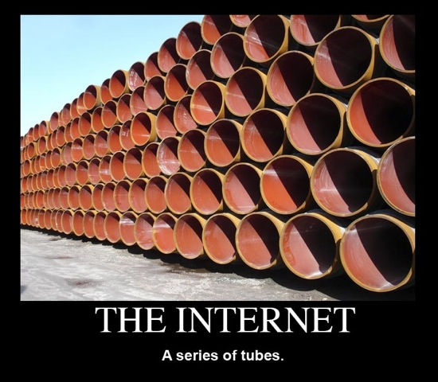

# Connecting the World with Networking

It is all just [a series of tubes](https://en.wikipedia.org/wiki/Series_of_tubes), a [series of tubes](https://www.youtube.com/watch?v=_cZC67wXUTs).

But the tubes have names.
Strange names.
`www.cs.seas.gwu.edu`...what's that, and which tube in the picture holds that?

## We need to put all our brains together to understand the tubes

Today we're going to do a lot of group-based investigation.
You're going to have to make a lot of educational guesses without much information, which requires on-point brainstorming skills.

There are better ways to brainstorm, and worse ways.
Your goals as a group are to

1. make sure that everyone speaks, and has the opportunity to speak, and
2. that when an idea is offered to the group, the first reply should be ["yes, and"](https://en.wikipedia.org/wiki/Yes,_and...).
	That is to say, your goal is to **build** on the idea of those before you, an to reinforce it, rather than divert the group's attention away (thus marginalize the idea).
	You'll go in some pretty crazy directions, and that's fine.

After you've generated a lot of ideas, go through a **separate** phase of "refining" those ideas, and determining which are the most likely.

The *algorithm* for your group interactions is as follows.

1. Choose question to answer.
2. One of the team-members should share a fact about themselves or detail an interest.
3. A team-member offers an idea.
4. Second team-member offers a "yes, and..." idea building off of that (this might get a little crazy).
5. Goto 3 until team has a volume of crazy ideas.
6. Refine the ideas and choose the most likely answers.
7. Goto 1 until there are no more questions in this section.
8. Activate the "yes" zoom emoji, and chat until other teams are done.

The [first stop](./t.md) on our tour of the tubes.

## Time to Detective the Heck out of the Tubes

Lets make use of the [DNS traversal tool](https://www.ultratools.com/tools/dnsTraversalResult).
[DNS](https://en.wikipedia.org/wiki/Domain_Name_System) is the "Domain Name System".
It is a "hierarchical" and "distributed" system to convert from `www.gwu.edu` into `128.164.141.12`.

- What does it mean for it to be hierarchical and distributed?

**Lookup: `www.gwu.edu`**

- What are the two sequences of symbols on the right in the following?

    

	What do they mean?
-

**Lookup: `www.facebook.edu`**

- There's an [easter egg](https://en.wikipedia.org/wiki/Easter_egg_(media)) hidden here.
	Can you find it?

**Lookup: `etsy.com` and `netflix.com`**

- There are some interesting similarities here.
	What are they, and can you explain them?
