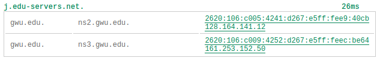

# Time to Detective (D) the Heck out of the Tubes

Lets make use of the [DNS traversal tool](https://www.ultratools.com/tools/dnsTraversalResult).
[DNS](https://en.wikipedia.org/wiki/Domain_Name_System) is the "Domain Name System".
It is a "hierarchical" and "distributed" system to convert from `www.gwu.edu` into `128.164.141.12`.

- What does it mean for it to be hierarchical and distributed?

*Lookup: `www.gwu.edu`*

- **Question 1D:** What are the two sequences of symbols on the right in the following?

    

	What do they mean?
	Why are there two sets of them?
- **Question 2D:** At the very bottom, it says that `www.gwu.edu` resolves to `www.gwu.edu.cdn.cloudflare.net`.
	Huh?
	Shouldn't GWU resolve to, you know, a GWU address?
	Any guesses what's happening here?

*Lookup: `etsy.com` and `netflix.com`*

- **Question 3D:** There are some interesting similarities here.
	What are they, and can you explain them?

*Lookup: `www.facebook.edu`*

- **Question 4D:** There's an [easter egg](https://en.wikipedia.org/wiki/Easter_egg_(media)) hidden here.
	Can you find it?
